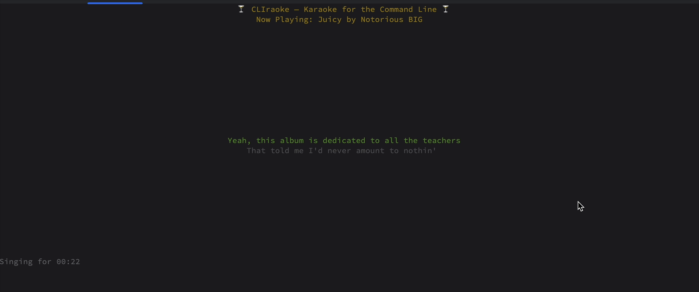

# CLIraoke

My first Rust app. Learned a lot. Swore a lot.

CLIraoke is karaoke for rustaceans too busy shaving ms to leave their command line. Lyrics so memory-safe you'll never forget them

## Usage

`cp .env-sample .env`

Get a [YouTube API](https://developers.google.com/youtube/v3/getting-started) key, because you can't have mine.

Add it to the `.env`

To build the binary, run 
```bash
cargo build --release
```

To run the binary, run
```bash
cargo run --release
```

To search from the homescreen, type `/` to enter search mode. Enter your search and hit enter to see song and lyric options.


CLIraoke also supports queuing. To see your queue, type `u`. To add a song at any time, search for a new song and select it in audio+lyrics selector.



You will then receive a list of synced lyrics from the awesome open project [LRCLib](https://lrclib.net/). Experiment with combinations, as the audio and lyrics may not be perfectly synced at start time.

## Troubleshooting

You may need to install `yt-dlp` and `ffmpeg` for this thing.
